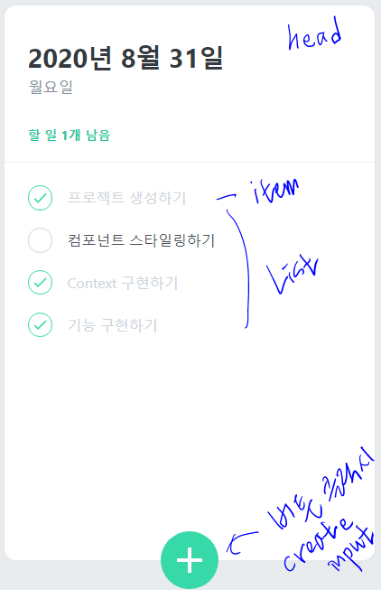

<<<<<<< HEAD
This project was bootstrapped with [Create React App](https://github.com/facebook/create-react-app).

## Available Scripts

In the project directory, you can run:

### `yarn start`

Runs the app in the development mode. 
Open [http://localhost:3000](http://localhost:3000) to view it in the browser.

The page will reload if you make edits. 
You will also see any lint errors in the console.

### `yarn test`

Launches the test runner in the interactive watch mode. 
See the section about [running tests](https://facebook.github.io/create-react-app/docs/running-tests) for more information.

### `yarn build`

Builds the app for production to the `build` folder. 
It correctly bundles React in production mode and optimizes the build for the best performance.

The build is minified and the filenames include the hashes. 
Your app is ready to be deployed!

See the section about [deployment](https://facebook.github.io/create-react-app/docs/deployment) for more information.

### `yarn eject`

**Note: this is a one-way operation. Once you `eject`, you can’t go back!**

If you aren’t satisfied with the build tool and configuration choices, you can `eject` at any time. This command will remove the single build dependency from your project.

Instead, it will copy all the configuration files and the transitive dependencies (webpack, Babel, ESLint, etc) right into your project so you have full control over them. All of the commands except `eject` will still work, but they will point to the copied scripts so you can tweak them. At this point you’re on your own.

You don’t have to ever use `eject`. The curated feature set is suitable for small and middle deployments, and you shouldn’t feel obligated to use this feature. However we understand that this tool wouldn’t be useful if you couldn’t customize it when you are ready for it.

## Learn More

You can learn more in the [Create React App documentation](https://facebook.github.io/create-react-app/docs/getting-started).

To learn React, check out the [React documentation](https://reactjs.org/).

### Code Splitting

This section has moved here: https://facebook.github.io/create-react-app/docs/code-splitting

### Analyzing the Bundle Size

This section has moved here: https://facebook.github.io/create-react-app/docs/analyzing-the-bundle-size

### Making a Progressive Web App

This section has moved here: https://facebook.github.io/create-react-app/docs/making-a-progressive-web-app

### Advanced Configuration

This section has moved here: https://facebook.github.io/create-react-app/docs/advanced-configuration

### Deployment

This section has moved here: https://facebook.github.io/create-react-app/docs/deployment

### `yarn build` fails to minify

This section has moved here: https://facebook.github.io/create-react-app/docs/troubleshooting#npm-run-build-fails-to-minify
=======
# react-Todolist
react todolist with function component / styled-components / react-icons / polished

# < TodoList 구조 >
 
- TodoHead - 
1. 현재 날짜 / 요일 표시 - new Date() 로 구현 
2. toLocaleDateString 으로 ko-KR 표시
3. undoneTasks - todo.done false만 담은 배열 길이로 표현 - 잔여 할일 표시

- TodoList -
1. todos.map() 사용하여 todos가 가진 목록 TodoListBlock에 나열

- TodoItem -
1. checkCircle done / undone - done true 일 때 icon MdDone 표시
2. Text 표시 - input value 에서 넘겨 받아 저장 useState 로 state 관리 + 불변성 유지
3. REMOVE hover 시 표시 - MdDelete icon click 시 해당 id 가진 목록 삭제 

- TodoCreate -
1. 아래 " + " 버튼 클릭시 나타남 - 클릭시 45도 돌면서 색상 변환 + input 창 생김
2. input form 태그 사용 - submit으로 넘김

### - TodoContext - 중요!
1. initialTodos 만들어두고 목록 4개 저장
2. todoReducer 함수 만들어서  useReducer 에 사용 / 위에서 만든 initialTodos 도 parameter로 사용
3. useReducer 에서 나온 state / dispatch 분리하여 각각의 Context API 만듦 - 최적화 용이
( state 와 dispatch 함께 하위 컴포넌트에 전달시 state가 변하더라도 리렌더링되는 문제가 생길 수 있음 )
4. todoReducer 에는 dispatch 함수에서 전달 받은 action.type -> "CREATE" "REMOVE" "TOGGLE" 3가지 case 로 나눔.
(CREATE - state에 concat하여 todo 저장 / REMOVE - fliter 메서드로 todo.id !== action.id로 다른것만 state에 저장
  TOGGLE - todo.id와 action.id가 같은지 확인 + 선택된 todoitem 안의 done값 true<->false 변경 id 다르면 다시 같은 todo 반환 )
5. nextId는 useRef()로 관리
6. Context API 사용하여 커스텀 컴포넌트 만듦 - createContext() useContext() export 로 다른 곳에서 바로 return 값 사용가능
사용법 참고 - https://velog.io/@i_thank/React-Context-API
>>>>>>> f6867d9680e340ba3734c8d35a4926abd31c1a00
